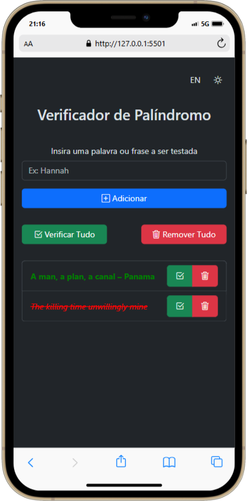
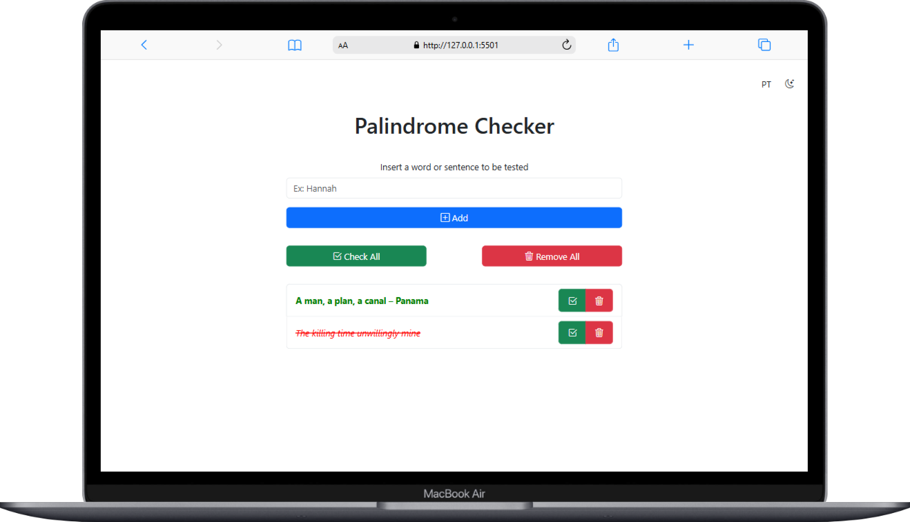

# Palindrome Checker

## Descrição

Este é um simples verificador de palíndromos web. Permite que você insira palavras ou frases, adicione-as a uma lista e verifique se cada item é um palíndromo (uma palavra, frase ou sequência que permanece a mesma quando lida de trás para frente). Os resultados são exibidos visualmente na lista, indicando se cada item é ou não um palíndromo. Além disso, oferece a funcionalidade de verificar todos os itens da lista de uma só vez e de remover itens individualmente ou a lista inteira. Os dados são persistidos localmente no navegador, o que significa que a lista de palavras/frases permanece mesmo após o fechamento da página.

## Demonstração

<!--  -->

## Como Começar

Para usar o Palindrome Checker localmente:

1.  **Clone ou baixe este repositório:** Se você tiver o projeto em um repositório, clone-o para sua máquina local. Caso contrário, salve os arquivos `index.html`, `style.css` e `script.js` no mesmo diretório.
2.  **Abra o arquivo `index.html` no seu navegador web.**

### Utilizando o Verificador

1.  **Inserir texto:** Digite a palavra ou frase que você deseja verificar no campo de texto com o rótulo "Insert a word or sentence to be tested".
2.  **Adicionar à lista:** Clique no botão "➕ Add". A palavra ou frase inserida será adicionada à lista abaixo.
3.  **Verificar individualmente (funcionalidade futura):** _(Com base no código, esta funcionalidade está implementada com os botões "✅" ao lado de cada item)_ Clique no botão "✅" ao lado de um item na lista para verificar se ele é um palíndromo. O item será destacado em verde se for um palíndromo e em vermelho (com tachado) caso contrário.
4.  **Verificar todos:** Clique no botão "Check All" para verificar todos os itens da lista de uma vez.
5.  **Remover individualmente:** Clique no botão "❌" ao lado de um item na lista para removê-lo.
6.  **Remover todos:** Clique no botão "Remove All" para limpar toda a lista.

## Estrutura de Arquivos

.  
├── index.html (A estrutura HTML da página)  
├── style.css (Os estilos CSS para a apresentação da página)  
└── script.js (A lógica JavaScript para a interatividade)

## Funcionalidades

- **Adicionar palavras/frases:** Permite adicionar palavras ou frases para serem verificadas.
- **Listagem dos itens:** Exibe uma lista dos itens adicionados.
- **Verificação individual:** _(Implementado)_ Permite verificar se um item específico na lista é um palíndromo.
- **Verificação de todos os itens:** Permite verificar todos os itens da lista simultaneamente.
- **Remoção individual:** Permite remover itens específicos da lista.
- **Remoção de todos os itens:** Permite limpar toda a lista.
- **Persistência local:** A lista de itens é armazenada localmente no navegador, mantendo os dados mesmo após o fechamento da página.
- **Feedback visual:** Indica claramente na lista se um item é ou não um palíndromo usando cores e estilos.

<!-- ## Próximos Passos (Com base no código parcial)

- **Implementar testes unitários:** Adicionar testes automatizados para garantir a robustez das funções de verificação de palíndromos.
- **Melhorar a interface do usuário:** Considerar melhorias visuais e de usabilidade.
- **Adicionar tratamento de erros:** Implementar mensagens de erro mais informativas para diferentes cenários.

## Contribuição

Contribuições são bem-vindas! Se você tiver alguma sugestão de melhoria, correção de bugs ou novas funcionalidades, sinta-se à vontade para abrir uma issue ou enviar um pull request.

1.  Faça um fork do repositório.
2.  Crie uma branch para sua feature (`git checkout -b feat/sua-feature`).
3.  Faça o commit das suas mudanças (`git commit -m 'feat: Add some feature'`).
4.  Faça o push para a branch (`git push origin feat/sua-feature`).
5.  Abra um pull request.

## Licença

Este projeto está sob a licença [INSERIR LICENÇA AQUI] - veja o arquivo [LICENSE.md](LICENSE.md) para detalhes.

---

Sinta-se à vontade para adicionar mais informações ou ajustar este README conforme o desenvolvimento do seu projeto avança. Incluir uma captura de tela na seção de "Demonstração" tornará o README ainda mais profissional e fácil de entender. -->
